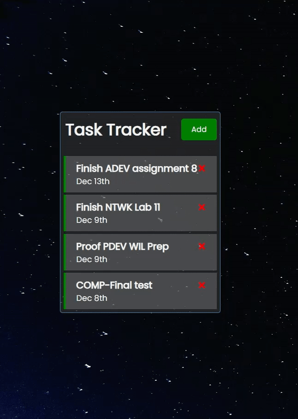

# ReactFromScratch (Task Tracker)
> This repo contains sample code from React JS Crash Course
>
> Reference Link: https://youtu.be/w7ejDZ8SWv8

## Contents
* HTML
* Javacript
* JSON
* React

## What I've learned
1. How to make the JSON file as server (`npm run server`)
2. How to build a task tracker app with
  - components
  - props
  - state
  - hooks
  - working with API

## Overview
| Start page | Task list |
|---------------------|---------------------|
|  | |

| Expanded Version - when user click the add button | 
|---------------------|
| |

| Demo |
|---------------------|
| |

<!-- CONTACT -->
## Contact

Sam Lee - [@LinkedIn](https://www.linkedin.com/in/devsamlee/) - LeeSam235711@gmail.com

(<a href="#top">back to top</a>)

